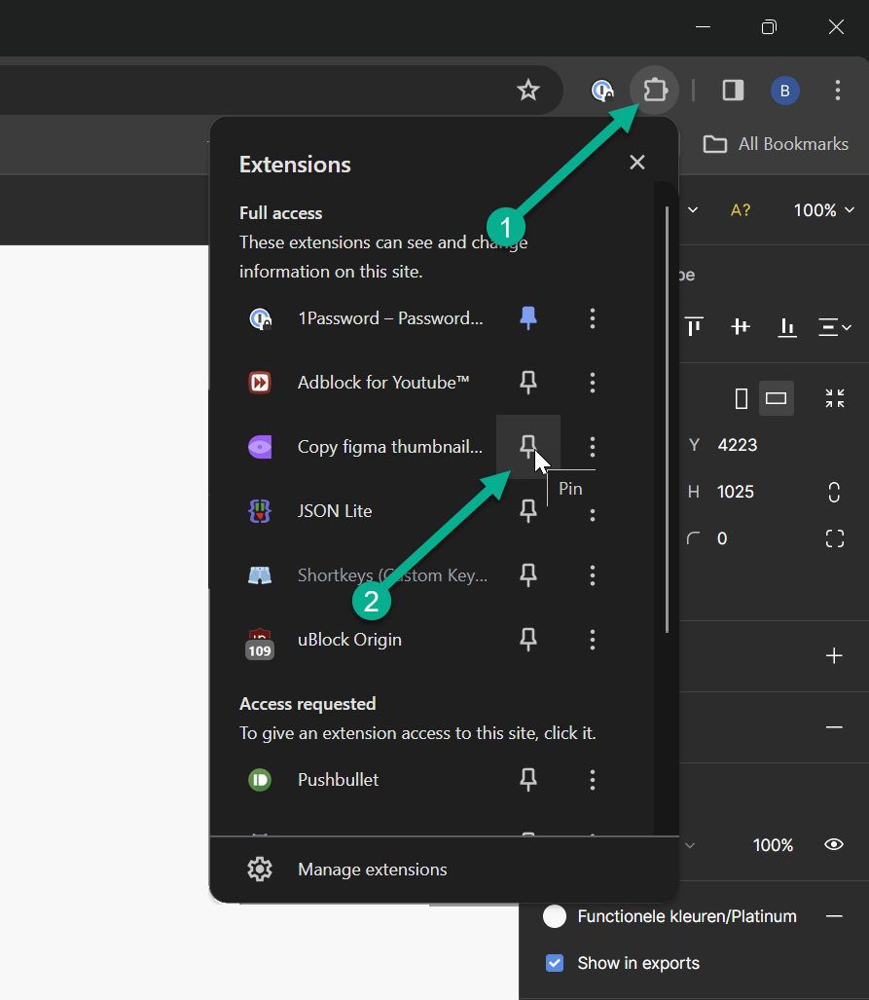
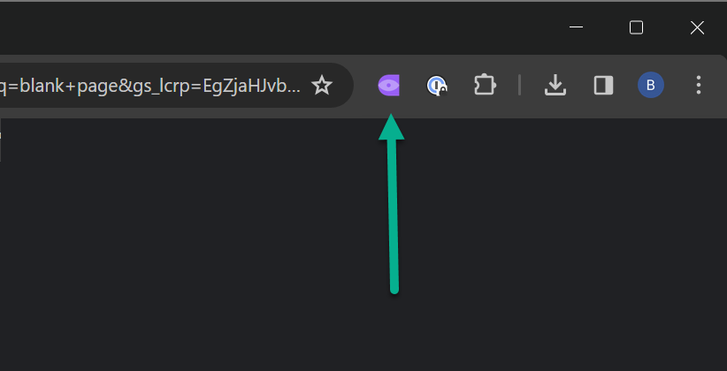
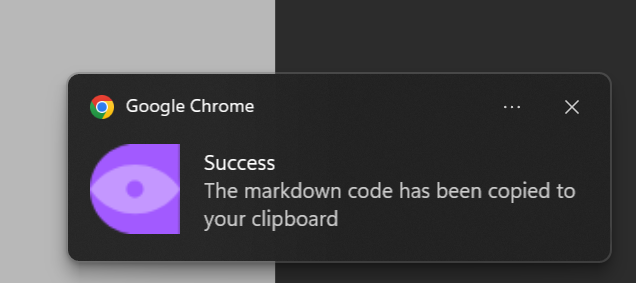

# Figma screen to dynamic screenshot for Jira

This Chrome extension will convert the current page url in figma with a screen selected
into the thumbnail url for that screen (in Markdown format).

So you can paste it into a jira ticket and the screenshot will always be up-to-date.

## Installation

### Server (only for the IT guy in your company)

This only has to happen once for your company.
This server will allow urls to be created that contain the file and node (screen) that is selected in figma.
So the thumbnail can be dynamically loaded each time the page loads.

You need to setup the nestJS server in the server folder.


### Extension (Users of the extension)

* download the zip from github (green button: Code => download zip)
* extract the zip into a folder
* surf to: [chrome://extensions](chrome://extensions)
* turn developer mode on
* load unpacked
* choose the path of the folder named 'chrome-extension' that was inside the zip
* Pin the extension, so it is always visible (optional)
  * 
* Right-click the extension button and click on options
  * 
* Set your server url, so the extension can get dynamic links to the figma thumbnails
  * 
* Go to a figma file and click one of the screen titles.
* The url should look like: `figma.com/file/<fileKey>/<title>?node-id=<nodeId>`
* Click the extension button. You should see the notification that the copy was successful:
  * 


The copied code will look like:
```markdown

https://www.figma.com/file/<fileKey>/<title>?node-id=<nodeId>
```
